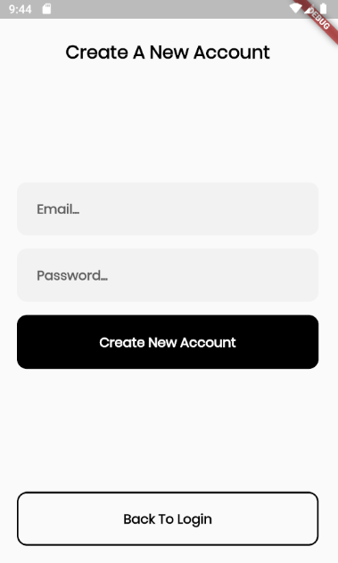
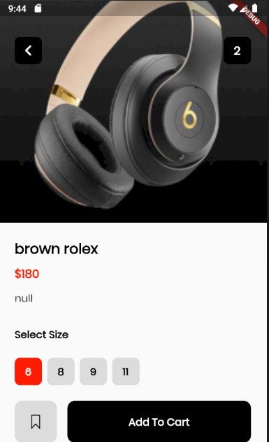
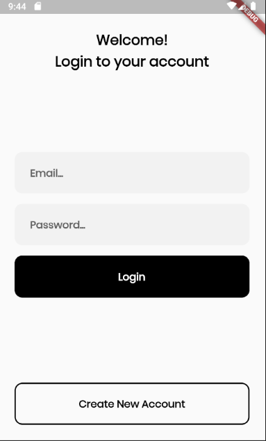
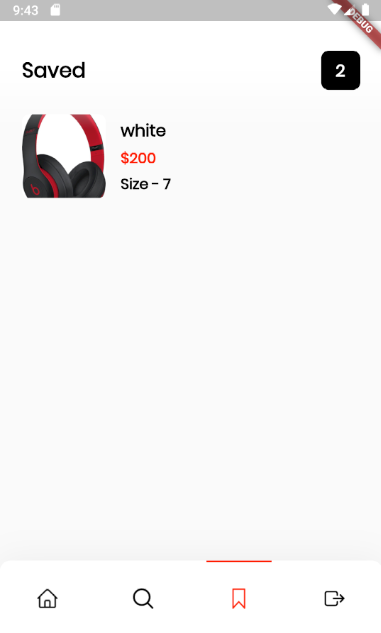
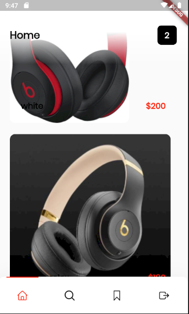

# flutter_app

### About
 This project is a fictiona ecomerce app intended to target phone accessories as the main product

### What can you find?
 - A working phone auth.
 -Working product page.
 -Working cart.

## ScreenShots
                             
                             

## Disclaimer!!
This project is still under construction

## Project setup and Installation
* installations such as JUnit, intellij, SDK, JDK, Android Studio.
*Install all flutter requirements such as dart.

1. Clone the repo `https://github.com/Ivan-Keli/`
2. Build and run th project

* Run App to compile the program

## Technologies used
* Dart

* Android.

* Firebase.

MIT License

Copyright (c) [2024] [Ivan Keli]

Permission is hereby granted, free of charge, to any person obtaining a copy
of this software and associated documentation files (the "Software"), to deal
in the Software without restriction, including without limitation the rights
to use, copy, modify, merge, publish, distribute, sublicense, and/or sell
copies of the Software, and to permit persons to whom the Software is
furnished to do so, subject to the following conditions:

The above copyright notice and this permission notice shall be included in all
copies or substantial portions of the Software.

THE SOFTWARE IS PROVIDED "AS IS", WITHOUT WARRANTY OF ANY KIND, EXPRESS OR
IMPLIED, INCLUDING BUT NOT LIMITED TO THE WARRANTIES OF MERCHANTABILITY,
FITNESS FOR A PARTICULAR PURPOSE AND NONIN-FRINGEMENT. IN NO EVENT SHALL THE
AUTHORS OR COPYRIGHT HOLDERS BE LIABLE FOR ANY CLAIM, DAMAGES OR OTHER
LIABILITY, WHETHER IN AN ACTION OF CONTRACT, TORT OR OTHERWISE, ARISING FROM,
OUT OF OR IN CONNECTION WITH THE SOFTWARE OR THE USE OR OTHER DEALINGS IN THE
SOFTWARE.
